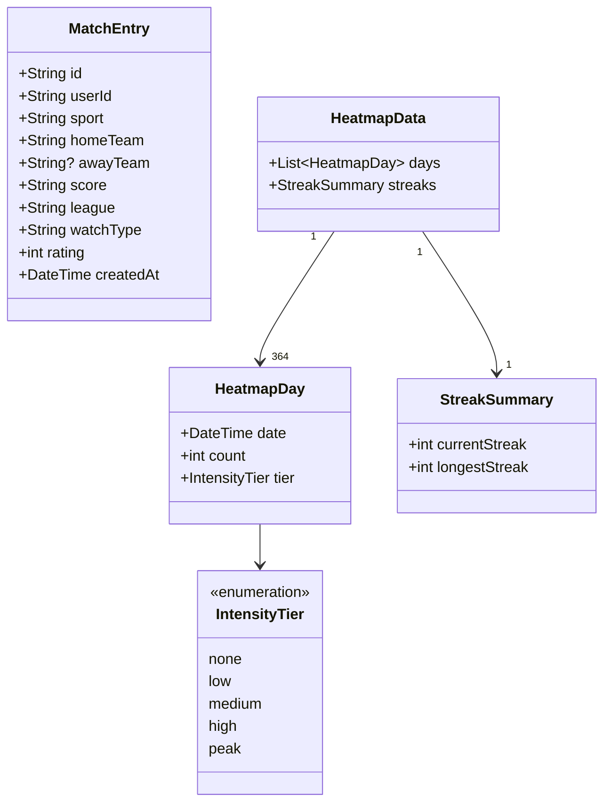

# Design Document — Calendar Heatmap

## Overview

The Calendar Heatmap is a GitHub-style activity grid embedded in the existing `StatsDashboard` screen. It visualises match-logging density across a rolling 52-week window, derived entirely from the `MatchEntry` objects already held in the local Drift database. No new network calls or separate analytics stores are introduced.

The feature consists of four collaborating pieces:

1. **View-model layer** — `HeatmapData`, `HeatmapDay`, `IntensityTier`, `StreakSummary` (pure Dart, no Flutter dependency).
2. **Provider layer** — `heatmapProvider` in `stats_providers.dart`, derived from the existing `diaryEntriesProvider`.
3. **Widget layer** — `CalendarHeatmap` (`ConsumerWidget`) containing a `CustomPainter`-based grid and a `StreakSummaryRow`.
4. **Sheet layer** — `DayDetailSheet`, a modal bottom sheet shown on cell tap.

### Key design decisions

- **Derive, don't duplicate.** `heatmapProvider` watches `diaryEntriesProvider` and transforms its output. This guarantees the heatmap and the rest of the stats screen are always in sync with the same data source.
- **Reuse streak logic.** A standalone `calculateStreaks` free function (extracted from `DiaryRepositoryImpl._calculateStreaks`) is called by both the existing `calculateStats` use-case and the new `heatmapProvider`. This eliminates the risk of divergent streak numbers.
- **CustomPainter for the grid.** Rendering 364 cells with individual Flutter widgets would be expensive. A single `CustomPainter` draws all cells in one pass; a parallel `List<Rect>` is kept for hit-testing.
- **Self-contained widget.** `CalendarHeatmap` reads `heatmapProvider` directly so `StatsDashboard` needs only a one-line insertion.

---

## Architecture

```
StatsDashboard (ConsumerWidget)
  └── CalendarHeatmap (ConsumerWidget)
        ├── watches heatmapProvider
        ├── HeatmapPainter (CustomPainter)  ← draws cells + month labels
        ├── GestureDetector                 ← hit-tests taps against cell rects
        ├── StreakSummaryRow (StatelessWidget)
        └── DayDetailSheet (shown via MatchLogBottomSheet.show)

heatmapProvider (StreamProvider.autoDispose<HeatmapData>)
  └── watches diaryEntriesProvider
        └── transforms List<MatchEntry> → HeatmapData
              ├── groups entries by local date
              ├── assigns IntensityTier per day
              └── calls calculateStreaks() → StreakSummary
```

Data flow is strictly one-way: Drift → `diaryEntriesProvider` → `heatmapProvider` → `CalendarHeatmap` → `HeatmapPainter` / `DayDetailSheet`.

---

## Components and Interfaces

### `HeatmapDay`

```dart
/// Immutable view-model for a single calendar day in the heatmap.
class HeatmapDay {
  final DateTime date;       // midnight-normalised local date
  final int count;           // number of MatchEntry objects on this date
  final IntensityTier tier;  // derived from count via IntensityTier.fromCount

  const HeatmapDay({
    required this.date,
    required this.count,
    required this.tier,
  });
}
```

### `HeatmapData`

```dart
/// Top-level view-model produced by heatmapProvider.
class HeatmapData {
  /// Ordered list of days in the 52-week window, oldest first.
  final List<HeatmapDay> days;
  final StreakSummary streaks;

  const HeatmapData({required this.days, required this.streaks});
}
```

### `StreakSummary`

```dart
class StreakSummary {
  final int currentStreak;
  final int longestStreak;

  const StreakSummary({
    required this.currentStreak,
    required this.longestStreak,
  });
}
```

### `IntensityTier`

```dart
enum IntensityTier { none, low, medium, high, peak }

extension IntensityTierX on IntensityTier {
  /// Maps a raw entry count to the appropriate tier.
  static IntensityTier fromCount(int count) => switch (count) {
    0      => IntensityTier.none,
    1      => IntensityTier.low,
    2      => IntensityTier.medium,
    3      => IntensityTier.high,
    _      => IntensityTier.peak,   // 4 or more
  };

  /// Returns the fill color for this tier.
  Color toColor() => switch (this) {
    IntensityTier.none   => MatchLogColors.surfaceBorder,
    IntensityTier.low    => MatchLogColors.secondary.withValues(alpha: 0.30),
    IntensityTier.medium => MatchLogColors.secondary.withValues(alpha: 0.55),
    IntensityTier.high   => MatchLogColors.secondary.withValues(alpha: 0.80),
    IntensityTier.peak   => MatchLogColors.secondary,
  };
}
```

### `heatmapProvider`

Lives in `lib/features/diary/presentation/providers/stats_providers.dart`.

```dart
final heatmapProvider =
    StreamProvider.autoDispose<HeatmapData>((ref) async* {
  final entriesAsync = ref.watch(diaryEntriesProvider);

  yield* entriesAsync.when(
    loading: () => const Stream.empty(),
    error:   (_, __) => const Stream.empty(),
    data:    (entries) => Stream.value(_buildHeatmapData(entries)),
  );
});
```

`_buildHeatmapData` is a pure function:

```dart
HeatmapData _buildHeatmapData(List<MatchEntry> entries) {
  final today = _today();
  final windowStart = today.subtract(const Duration(days: 363)); // 364 days inclusive

  // Group entries by normalised date, restricted to the window.
  final countByDate = <DateTime, int>{};
  for (final e in entries) {
    final d = _normalise(e.createdAt);
    if (!d.isBefore(windowStart) && !d.isAfter(today)) {
      countByDate[d] = (countByDate[d] ?? 0) + 1;
    }
  }

  // Build one HeatmapDay per day in the window.
  final days = <HeatmapDay>[];
  for (var i = 0; i < 364; i++) {
    final date = windowStart.add(Duration(days: i));
    final count = countByDate[date] ?? 0;
    days.add(HeatmapDay(
      date: date,
      count: count,
      tier: IntensityTierX.fromCount(count),
    ));
  }

  final streaks = calculateStreaks(entries);
  return HeatmapData(days: days, streaks: streaks);
}

DateTime _today() {
  final n = DateTime.now();
  return DateTime(n.year, n.month, n.day);
}

DateTime _normalise(DateTime dt) => DateTime(dt.year, dt.month, dt.day);
```

### `calculateStreaks` (shared free function)

Extracted to `lib/features/diary/domain/utils/streak_calculator.dart` so both `DiaryRepositoryImpl` and `heatmapProvider` call the same implementation:

```dart
/// Returns (currentStreak, longestStreak) for a list of entries.
/// Identical algorithm to DiaryRepositoryImpl._calculateStreaks.
(int current, int longest) calculateStreaks(List<MatchEntry> entries) { ... }
```

`DiaryRepositoryImpl._calculateStreaks` is updated to delegate to this function.

### `CalendarHeatmap`

```dart
class CalendarHeatmap extends ConsumerWidget {
  const CalendarHeatmap({super.key});

  @override
  Widget build(BuildContext context, WidgetRef ref) {
    final heatmapAsync = ref.watch(heatmapProvider);

    return heatmapAsync.when(
      loading: () => const _HeatmapShimmer(),
      error:   (e, _) => _HeatmapError(message: e.toString()),
      data:    (data) => data.days.every((d) => d.count == 0)
          ? const _HeatmapEmpty()
          : _HeatmapContent(data: data),
    );
  }
}
```

`_HeatmapContent` composes:
- A `Text` section header ("Activity").
- A `SingleChildScrollView(scrollDirection: Axis.horizontal)` wrapping a `GestureDetector` + `CustomPaint`.
- A `StreakSummaryRow` below the scroll view.

### `HeatmapPainter` (CustomPainter)

```dart
class HeatmapPainter extends CustomPainter {
  final List<HeatmapDay> days;
  final List<Rect> cellRects; // populated during paint, exposed for hit-testing

  // Layout constants (derived from MatchLogSpacing tokens)
  static const double cellSize = MatchLogSpacing.md;  // 12 px
  static const double gap      = MatchLogSpacing.xs;  // 4 px
  static const double step     = cellSize + gap;      // 16 px
  static const double monthLabelHeight = MatchLogSpacing.lg; // 16 px

  @override
  void paint(Canvas canvas, Size size) {
    // days[0] is the oldest day; compute its column offset so that
    // column 0 starts on the Sunday of the week containing windowStart.
    // Each column = one week (7 cells, Sun=row 0 … Sat=row 6).
    // Month labels are drawn above the first column of each new month.
  }

  @override
  bool shouldRepaint(HeatmapPainter old) => old.days != days;
}
```

**Grid geometry:**

- Total columns: 53 (52 full weeks + partial first/last week).
- Total rows: 7 (Sunday … Saturday).
- Canvas width: `53 * step - gap` ≈ 844 px (scrollable).
- Canvas height: `monthLabelHeight + 7 * step - gap` ≈ 124 px.
- Cell origin: `Offset(col * step, monthLabelHeight + row * step)`.
- Cell rect: `Rect.fromLTWH(x, y, cellSize, cellSize)`.
- Rounded rect radius: `MatchLogSpacing.radiusSm / 2` (4 px) for a subtle rounding.

**Month labels:**

The painter iterates columns. When the Monday of a column falls in a different month than the previous column, it draws the abbreviated month name (`Jan`, `Feb`, …) at `Offset(col * step, 0)` using `TextPainter` with `theme.textTheme.labelSmall` style.

### Tap detection

```dart
GestureDetector(
  onTapUp: (details) {
    final local = details.localPosition;
    final idx = _painter.cellRects.indexWhere((r) => r.contains(local));
    if (idx >= 0) _onCellTap(context, data.days[idx]);
  },
  child: CustomPaint(painter: _painter, size: _canvasSize),
)
```

`_onCellTap` calls `MatchLogBottomSheet.show` with a `DayDetailSheet` regardless of whether the cell has entries (requirement 5.3).

### `DayDetailSheet`

```dart
class DayDetailSheet extends StatelessWidget {
  final HeatmapDay day;
  final List<MatchEntry> entries; // pre-filtered to this day

  const DayDetailSheet({super.key, required this.day, required this.entries});
}
```

Layout:
- Header: formatted date (e.g. "Wednesday, 14 May 2025").
- If `entries.isEmpty`: `EmptyState`-style message ("No matches logged on this day").
- If `entries.isNotEmpty`: `ListView` of compact match rows, each showing:
  - Sport icon (from `MatchLogColors.sportAccent`)
  - `homeTeam` (and `awayTeam` if present)
  - `score`
  - Star rating (filled/empty icons, `rating` out of 5)

The sheet is presented via `MatchLogBottomSheet.show` (existing shared widget), which provides the drag handle, rounded top corners, and `isDismissible: true` / `enableDrag: true` by default.

### `StreakSummaryRow`

```dart
class StreakSummaryRow extends StatelessWidget {
  final StreakSummary streaks;
  const StreakSummaryRow({super.key, required this.streaks});
}
```

Renders two `StatCard`-style tiles side by side:
- "Current streak" — `streaks.currentStreak == 0 ? 'No active streak' : '${streaks.currentStreak} days'`
- "Longest streak" — `'${streaks.longestStreak} days'`

### `_HeatmapShimmer`

A `MatchLogShimmer`-wrapped placeholder that mimics the grid dimensions: a single rounded rectangle `cellSize * 7` tall and `step * 53` wide, plus two small boxes below for the streak tiles.

### `_HeatmapError`

Uses the existing `ErrorState` widget with an `onRetry` callback that calls `ref.invalidate(heatmapProvider)`.

### `_HeatmapEmpty`

Uses the existing `EmptyState` widget:
```dart
EmptyState(
  icon: Icons.calendar_today_outlined,
  title: 'No activity yet',
  subtitle: 'Log your first match and it will appear here.',
)
```

---

## Data Models

### Class diagram



### Tier threshold table

| Count | Tier     | Color token                                    |
|-------|----------|------------------------------------------------|
| 0     | `none`   | `MatchLogColors.surfaceBorder`                 |
| 1     | `low`    | `MatchLogColors.secondary` @ 30 % opacity      |
| 2     | `medium` | `MatchLogColors.secondary` @ 55 % opacity      |
| 3     | `high`   | `MatchLogColors.secondary` @ 80 % opacity      |
| ≥ 4   | `peak`   | `MatchLogColors.secondary` (full opacity)      |

### Window definition

- **End**: `DateTime(now.year, now.month, now.day)` — today at midnight local time.
- **Start**: `end.subtract(const Duration(days: 363))` — 364 days inclusive.
- Entries with `createdAt` before `windowStart` are excluded from cell counts but still included in streak calculation (streaks can predate the visible window).

---

## Correctness Properties

*A property is a characteristic or behavior that should hold true across all valid executions of a system — essentially, a formal statement about what the system should do. Properties serve as the bridge between human-readable specifications and machine-verifiable correctness guarantees.*

### Property 1: Entry count conservation

*For any* list of `MatchEntry` objects, the sum of `count` across all `HeatmapDay` objects in the resulting `HeatmapData` SHALL equal the number of entries whose `createdAt` (normalised to midnight) falls within the 364-day window.

**Validates: Requirements 1.5, 8.4**

---

### Property 2: Tier assignment correctness

*For any* non-negative integer `n`, `IntensityTierX.fromCount(n)` SHALL return `none` when `n == 0`, `low` when `n == 1`, `medium` when `n == 2`, `high` when `n == 3`, and `peak` when `n >= 4`.

**Validates: Requirements 2.1, 2.2**

---

### Property 3: Current streak never exceeds longest streak

*For any* list of `MatchEntry` objects, the `currentStreak` value in the resulting `StreakSummary` SHALL be less than or equal to `longestStreak`.

**Validates: Requirements 4.3, 8.5**

---

### Property 4: Month labels appear at correct column positions

*For any* 364-day window, the abbreviated month label for month M SHALL appear above the first column whose week contains the first day of month M (or the first column of the grid if month M starts before the window).

**Validates: Requirements 3.4**

---

### Property 5: DayDetailSheet displays required fields for all entries

*For any* `MatchEntry`, when `DayDetailSheet` is rendered with that entry in its list, the rendered widget tree SHALL contain the entry's `homeTeam`, `sport`, `score`, and `rating` values.

**Validates: Requirements 5.4**

---

## Error Handling

| Scenario | Behaviour |
|---|---|
| `diaryEntriesProvider` loading | `CalendarHeatmap` renders `_HeatmapShimmer`; parent `StatsDashboard` is unaffected |
| `diaryEntriesProvider` error | `CalendarHeatmap` renders `_HeatmapError` with retry; error does not propagate |
| Empty entry list | `CalendarHeatmap` renders `_HeatmapEmpty`; no layout exceptions |
| `_buildHeatmapData` throws | Caught by `heatmapProvider`'s error state; surfaced as `_HeatmapError` |
| Tap on cell with no entries | `DayDetailSheet` opens with empty-day message; no crash |
| `calculateStreaks` called with empty list | Returns `(0, 0)`; `StreakSummaryRow` shows "No active streak" / "0 days" |

---

## Testing Strategy

### Unit tests — `HeatmapProvider` logic

File: `test/features/diary/presentation/providers/heatmap_provider_test.dart`

- **Day grouping**: given entries on the same date, verify `HeatmapDay.count` equals the number of entries on that date.
- **Window boundary**: entries exactly on `windowStart` are included; entries one day before are excluded.
- **Tier thresholds**: boundary values 0, 1, 2, 3, 4, 5 each produce the expected `IntensityTier`.
- **Streak equivalence**: verify `heatmapProvider` streak output matches `calculateStreaks` output for the same input.

### Unit tests — `IntensityTier`

File: `test/features/diary/domain/utils/intensity_tier_test.dart`

- Boundary values: 0 → `none`, 1 → `low`, 2 → `medium`, 3 → `high`, 4 → `peak`, 100 → `peak`.

### Unit tests — `calculateStreaks`

File: `test/features/diary/domain/utils/streak_calculator_test.dart`

- Empty list → `(0, 0)`.
- Single entry today → `(1, 1)`.
- Consecutive days → correct current and longest.
- Gap in entries → current streak resets.

### Widget tests — `CalendarHeatmap`

File: `test/features/diary/presentation/widgets/calendar_heatmap_test.dart`

- Empty state renders `EmptyState` widget when entry list is empty (Requirement 6.1).
- Loading state renders shimmer placeholder (Requirement 7.4).
- Error state renders `ErrorState` widget (Requirement 7.5).
- Tapping a populated cell opens `DayDetailSheet` (Requirement 5.2).
- Tapping an empty cell opens `DayDetailSheet` with empty-day message (Requirement 5.3).
- `currentStreak == 0` shows "No active streak" label, not "0 days" (Requirement 4.4).
- `CalendarHeatmap` appears in `StatsDashboard` widget tree (Requirement 7.1).

### Property-based tests

Uses [`kiri_check`](https://pub.dev/packages/kiri_check) (Dart PBT library). Each property test runs a minimum of **100 iterations**.

File: `test/features/diary/presentation/providers/heatmap_provider_property_test.dart`

**Property 1 — Entry count conservation** *(Requirement 1.5, 8.4)*
```
// Feature: calendar-heatmap, Property 1: entry count conservation
// For any list of MatchEntry objects, sum of HeatmapDay.count == entries within window.
```
Generator: arbitrary list of `MatchEntry` with random `createdAt` values spanning ±2 years from today.

**Property 2 — Tier assignment correctness** *(Requirements 2.1, 2.2)*
```
// Feature: calendar-heatmap, Property 2: tier assignment correctness
// For any non-negative integer n, IntensityTierX.fromCount(n) returns the correct tier.
```
Generator: arbitrary non-negative integers (0 to 1000).

**Property 3 — Current streak ≤ longest streak** *(Requirements 4.3, 8.5)*
```
// Feature: calendar-heatmap, Property 3: currentStreak <= longestStreak
// For any list of MatchEntry objects, currentStreak <= longestStreak.
```
Generator: arbitrary list of `MatchEntry` with random `createdAt` values.

**Property 4 — Month label column positions** *(Requirement 3.4)*
```
// Feature: calendar-heatmap, Property 4: month labels at correct columns
// For any 364-day window, month labels appear at the first column of each new month.
```
Generator: arbitrary `DateTime` as the window end date.

**Property 5 — DayDetailSheet required fields** *(Requirement 5.4)*
```
// Feature: calendar-heatmap, Property 5: DayDetailSheet displays required fields
// For any MatchEntry, the rendered DayDetailSheet contains homeTeam, sport, score, rating.
```
Generator: arbitrary `MatchEntry` objects with random field values.

### Integration point

`StatsDashboard` integration is verified by the widget test for Requirement 7.1. No separate integration test file is needed since the heatmap derives data from the same Drift stream used by the rest of the stats screen.
